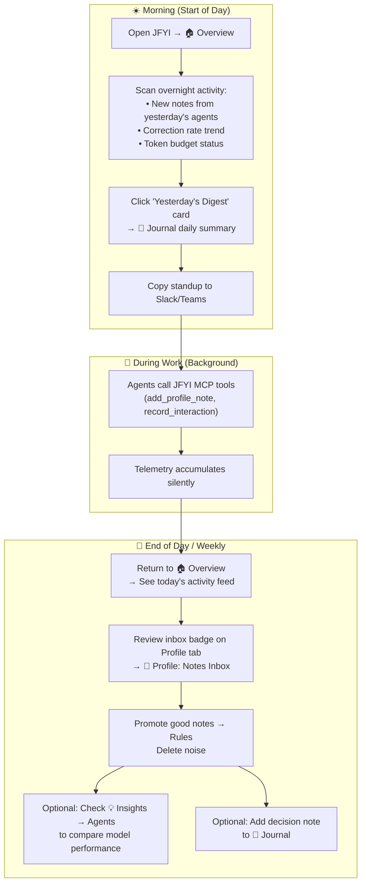

# JFYI Dashboard UX Redesign — Detailed Plan

**Target:** `v2.17.0` (Phase 1) / `v2.18.0` (Phases 2–3)  
**Status:** Planned  
**Tag:** Core (Overview, Profile merge) + Supplementary (Insights group)  
**Depends on:** [docs/journal.md](journal.md) (Phase 2)

## Executive Summary

The current JFYI dashboard has 7 top-level tabs that reflect the project's development history rather than the user's mental model. This plan reorganizes them into **4 clear areas** with a new **living Overview page** as the default landing, making the product immediately understandable to any new user.

> [!IMPORTANT]
> All existing backend endpoints and functionality are preserved. This is a **frontend navigation and layout restructure**, not a backend rewrite.

---

## Navigation: Before → After

````carousel
### Before (7 flat tabs, history-driven)
```
🔌 How to Connect → 📝 Notes → 👤 Developer Profile → 📊 Agent Analytics → 📈 My Analytics → 🧠 Memory Explorer → 🛡️ Admin
```

Every tab is a peer. New users don't know where to start.
The home route (`/`) redirects to `/connect` — a config page.
Memory Explorer is a stub showing "coming soon."
<!-- slide -->
### After (4 clear areas, user-driven)
```
🏠 Overview    👤 Profile    💡 Insights ▾    ⚙️ Settings
                              ├─ 📖 Journal
                              ├─ 📊 Agents
                              ├─ 📈 Trends
                              └─ 🧠 Memory
```

Overview is the living home page.
Profile is the core product (Notes + Rules unified).
Insights is a dropdown grouping all analytical views.
Settings consolidates Connect + Admin.
````

---

## User Journey: A Typical Day

The redesign is built around **how a developer actually uses JFYI throughout their workday**:



---

## Page-by-Page Design

### 1. 🏠 Overview (New Default Landing)

**Route:** `/` (no longer redirects to `/connect`)

**Purpose:** A living dashboard that answers *"What's the state of my coding DNA right now?"*

**Layout:**

```
┌─────────────────────────────────────────────────────────────┐
│  KPI Cards Row (4 cards)                                    │
│  ┌──────────┐ ┌──────────┐ ┌──────────┐ ┌──────────┐      │
│  │ 1,420    │ │ 92%      │ │ 18 rules │ │ 3 agents │      │
│  │ Sessions │ │ Alignment│ │ 420/800t │ │ tracked  │      │
│  └──────────┘ └──────────┘ └──────────┘ └──────────┘      │
├─────────────────────────────────────────────────────────────┤
│  Left Column (60%)          │  Right Column (40%)           │
│  ┌───────────────────────┐  │  ┌─────────────────────────┐ │
│  │ 7-Day Trend Sparkline │  │  │ 📬 Notes Inbox (5 new) │ │
│  │ (correction rate)     │  │  │ • "Prefers snake_case"  │ │
│  └───────────────────────┘  │  │ • "Always adds tests"   │ │
│  ┌───────────────────────┐  │  │         → View all      │ │
│  │ 🤖 Top Agents        │  │  └─────────────────────────┘ │
│  │ Claude: 95% aligned  │  │  ┌─────────────────────────┐ │
│  │ GPT-4o: 87% aligned  │  │  │ 📖 Yesterday's Digest  │ │
│  │ Copilot: 82% aligned │  │  │ Built: auth refactor    │ │
│  └───────────────────────┘  │  │ Friction: 2 corrections │ │
│  ┌───────────────────────┐  │  │         → Open Journal  │ │
│  │ ⚡ Recent Activity    │  │  └─────────────────────────┘ │
│  │ • 14:32 Claude: note  │  │                              │
│  │ • 13:15 GPT: friction │  │                              │
│  │ • 11:40 Claude: match │  │                              │
│  └───────────────────────┘  │                              │
└─────────────────────────────────────────────────────────────┘
```

**Data sources (all existing endpoints — no new backend needed):**

| Widget | Endpoint | Notes |
|--------|----------|-------|
| KPI Cards | `GET /api/developer/summary` + `GET /api/developer/constitution-budget` | Total interactions, correction rate, rules count, token budget |
| Agent summary | `GET /api/analytics/agents` | Top 3 by alignment score |
| 7-day sparkline | `GET /api/developer/trend?days=7` | Already returns daily correction rates |
| Notes inbox preview | `GET /api/profile/notes?limit=5` | Shows count badge in nav |
| Recent activity | `GET /api/analytics/friction-events?limit=5` | Combined with vibe matches |
| Yesterday's digest | `GET /api/journal/standup` | *New endpoint (Phase 7)* |

**Zero-state (new user, no data):**
Instead of KPIs, show a friendly onboarding card:
1. *"Generate your MCP token"* → link to Settings/Connect
2. *"Take the 2-minute style interview"* → link to Profile interview
3. *"Start coding with your AI agent — JFYI learns in the background"*

---

### 2. 👤 Profile (Core Product — Unified)

**Route:** `/profile`

**Purpose:** Everything about the developer's coding DNA in one place.

Merges the current **Notes** (`/notes`) and **Developer Profile** (`/profile`) pages into **two sub-tabs within a single view**:

```
┌─────────────────────────────────────────────────────────────┐
│  👤 Profile                                                 │
│  ┌─────────────────┐  ┌────────────────────┐               │
│  │ 📜 Constitution │  │ 📬 Notes Inbox (5) │               │
│  └─────────────────┘  └────────────────────┘               │
├─────────────────────────────────────────────────────────────┤
│                                                             │
│  (Active sub-tab content renders here)                      │
│                                                             │
└─────────────────────────────────────────────────────────────┘
```

**Sub-tab: 📜 Constitution (default)**
- Current `/profile` page content: curated rules table, add rule, export AGENTS.md, token budget bar.
- Account & linked identities section.
- Link to Vibe Profile Report (`/reports/vibe-profile`).

**Sub-tab: 📬 Notes Inbox**
- Current `/notes` page content: raw observations table, synthesis wizard, interview trigger, compose-to-rule modal.
- Badge count shown in tab label when unreviewed notes exist.
- Also shown as a preview widget on Overview.

**Why merge?** These two pages are two sides of the same coin (raw vs curated). A developer working through their notes always ends up on the rules page. Putting them adjacent as sub-tabs reduces navigation friction and makes the write-raw→curate→read-curated flow physically visible.

---

### 3. 💡 Insights (Dropdown Group)

**Purpose:** All analytical, exploratory, and reflective views grouped under one nav item with a dropdown menu.

**Nav behavior:** Hovering or clicking `💡 Insights` reveals a dropdown:

```
💡 Insights ▾
├─ 📖 Journal        (/insights/journal)
├─ 📊 Agents         (/insights/agents)
├─ 📈 Trends         (/insights/trends)
└─ 🧠 Memory         (/insights/memory)
```

#### 3a. 📖 Journal (`/insights/journal`)

**Status:** New page (Phase 7 — [docs/journal.md](file:///home/larry/Projects/jfyi/docs/journal.md))

- Daily timeline with digest cards, friction summaries, and decision notes.
- Quick-entry bar for architectural decisions.
- Standup export button (clipboard markdown).

#### 3b. 📊 Agents (`/insights/agents`)

**Status:** Existing page, moved from `/analytics`

- Current Agent Analytics content: agent comparison table, alignment bars, KPI summary cards.
- No content changes needed — just re-routed.

#### 3c. 📈 Trends (`/insights/trends`)

**Status:** Existing page, moved from `/developer`

- Current My Analytics / Developer Analytics content: correction rate trend, friction by agent, latency distribution, rule health, effectiveness scores, retirement queue, vibe map, vibe matches.
- Rename from "My Analytics" to "Trends" for clarity.

#### 3d. 🧠 Memory (`/insights/memory`)

**Status:** Currently a stub — to be implemented

- Episodic memory browser (past session summaries from `recall_episodic`).
- Friction event explorer with filtering by agent, date range, and category.
- Session replay: view what happened in a specific interaction session.

**Existing backend endpoints ready for this page:**

| Endpoint | What it provides |
|----------|-----------------|
| `GET /api/analytics/friction-events` | Recent friction events with descriptions |
| `GET /api/analytics/friction-clusters` | Clustered friction patterns |
| `db.get_best_sessions()` | Zero-friction session list (not yet exposed as REST) |
| `db.get_session_telemetry()` | Per-session alignment and corrections (not yet exposed) |

---

### 4. ⚙️ Settings

**Route:** `/settings`

**Purpose:** Configuration and administration — things you set up once and occasionally revisit.

**Sub-sections (single scrollable page or accordion):**

```
┌─────────────────────────────────────────────────────────────┐
│  ⚙️ Settings                                               │
├─────────────────────────────────────────────────────────────┤
│  🔌 Connect Your Agent                                     │
│  ┌─────────────────────────────────────────────────────┐   │
│  │ SSE Endpoint: https://jfyi.example.com/mcp/sse     │   │
│  │ Token: ●●●●●●●● [Generate] [Copy]                  │   │
│  │ MCP Config JSON snippet [Copy]                      │   │
│  └─────────────────────────────────────────────────────┘   │
├─────────────────────────────────────────────────────────────┤
│  🛡️ Administration (admin only, collapsed for others)      │
│  ┌─────────────────────────────────────────────────────┐   │
│  │ Registration: [Open / Closed toggle]                │   │
│  │ Users table, IdP management, About                  │   │
│  └─────────────────────────────────────────────────────┘   │
└─────────────────────────────────────────────────────────────┘
```

Merges current `/connect` and `/admin` into one settings hub. Connect content is always visible; Admin section is shown only for admin users (using the existing `is_admin` check).

---

## Route Mapping: Old → New

| Old Route | Old Nav Label | New Route | New Location |
|-----------|---------------|-----------|--------------|
| `/` → `/connect` | *(redirect)* | `/` | 🏠 Overview (new page) |
| `/connect` | 🔌 How to Connect | `/settings` | ⚙️ Settings (Connect section) |
| `/notes` | 📝 Notes | `/profile?tab=notes` | 👤 Profile → Notes Inbox sub-tab |
| `/profile` | 👤 Developer Profile | `/profile` | 👤 Profile → Constitution sub-tab |
| `/analytics` | 📊 Agent Analytics | `/insights/agents` | 💡 Insights → Agents |
| `/developer` | 📈 My Analytics | `/insights/trends` | 💡 Insights → Trends |
| `/memory` | 🧠 Memory Explorer | `/insights/memory` | 💡 Insights → Memory |
| `/admin` | 🛡️ Admin | `/settings` | ⚙️ Settings (Admin section) |
| *(new)* | — | `/insights/journal` | 💡 Insights → Journal |

> [!TIP]
> Old routes should remain as redirects for bookmarks and external links. E.g., `/notes` → `/profile?tab=notes`, `/analytics` → `/insights/agents`.

---

## Daily Usage Scenarios

### Scenario 1: Developer's Morning Routine (2 minutes)

```
1. Open JFYI bookmark → lands on 🏠 Overview
2. Glance at KPIs: "92% alignment yesterday, 3 new notes in inbox"
3. Click "Yesterday's Digest" card → 📖 Journal
   → Reads: "Refactored auth module, 2 corrections on test naming"
4. Click "Copy Standup" → pastes into Slack
5. Notices inbox badge (3) on Profile tab → clicks 👤 Profile → Notes
   → Promotes 1 good note to a rule, deletes 2 noisy ones
6. Done. Starts coding.
```

### Scenario 2: Mid-Day Quick Check (30 seconds)

```
1. Switches to JFYI tab → 🏠 Overview
2. Sees "Recent Activity": Claude just logged a note about import style
3. Glances at alignment score: still 92% → all good
4. Switches back to IDE
```

### Scenario 3: End-of-Week Reflection (5 minutes)

```
1. Opens 🏠 Overview → clicks 💡 Insights → 📈 Trends
2. Switches trend view to 30 days
   → Notices correction rate dropped from 15% to 8% over the month
   → Rule effectiveness table shows 3 high-impact rules
3. Clicks 💡 Insights → 📊 Agents
   → Sees Claude Code at 95% alignment vs Copilot at 78%
   → Considers switching Copilot config
4. Clicks 💡 Insights → 📖 Journal
   → Scrolls through the week's decision notes
   → Adds a reflection: "Moved to new testing strategy this week"
5. Opens Vibe Profile Report from 👤 Profile → shares with team
```

### Scenario 4: New User First Visit

```
1. Signs in via OAuth → lands on 🏠 Overview
2. Overview shows zero-state onboarding:
   ┌──────────────────────────────────────────────┐
   │  👋 Welcome to JFYI!                         │
   │                                               │
   │  JFYI learns your coding style and helps AI  │
   │  agents work the way you prefer.              │
   │                                               │
   │  1. 🔌 Connect your agent  → [Settings]      │
   │  2. 🎤 Take the style interview (2 min)       │
   │     → [Start Interview]                       │
   │  3. 💻 Start coding — JFYI observes silently │
   └──────────────────────────────────────────────┘
3. Clicks "Start Interview" → Profile Interview modal opens
4. Answers 5 questions → 5 raw notes created
5. Overview reloads: now shows "5 notes in inbox, 0 rules"
6. User visits Profile → promotes notes to first rules
7. Overview now shows live KPIs
```

---

## Implementation Phases

### Phase 1: Overview Page + Navigation Restructure
**Scope:** Frontend only. No new backend endpoints.

1. Create `Overview` component using existing endpoints (`/api/developer/summary`, `/api/developer/constitution-budget`, `/api/analytics/agents`, `/api/developer/trend?days=7`, `/api/profile/notes`, `/api/analytics/friction-events`).
2. Add zero-state onboarding card for new users.
3. Restructure navigation: 4 top-level items with Insights dropdown.
4. Merge Notes + Profile into unified Profile page with sub-tabs.
5. Merge Connect + Admin into Settings page.
6. Add redirect aliases for old routes.

### Phase 2: Journal Integration
**Scope:** Backend + Frontend (depends on [docs/journal.md](file:///home/larry/Projects/jfyi/docs/journal.md))

1. Implement Journal backend (schema, CRUD endpoints, MCP tools).
2. Add Journal page under Insights.
3. Wire "Yesterday's Digest" card on Overview to Journal.
4. Wire standup export button.

### Phase 3: Memory Explorer Implementation
**Scope:** Backend endpoint exposure + Frontend

1. Expose `db.get_best_sessions()` and `db.get_session_telemetry()` as REST endpoints.
2. Build Memory page with session browser, friction event explorer, and session replay.

---

## Summary of Backend Work Required

| What | Backend Change | Priority |
|------|---------------|----------|
| Overview page | **None** — all data available from existing endpoints | Phase 1 |
| Nav restructure | **None** — pure frontend | Phase 1 |
| Profile merge | **None** — reuses existing `/api/profile/*` endpoints | Phase 1 |
| Settings merge | **None** — reuses existing `/connect` + `/admin` endpoints | Phase 1 |
| Optional: `GET /api/overview` | Bundle endpoint for single round-trip (optimization) | Phase 1 (nice-to-have) |
| Journal | **New** — schema, CRUD, MCP tools per [docs/journal.md](file:///home/larry/Projects/jfyi/docs/journal.md) | Phase 2 |
| Memory Explorer | **Expose existing** `db.get_best_sessions()`, `db.get_session_telemetry()` | Phase 3 |
